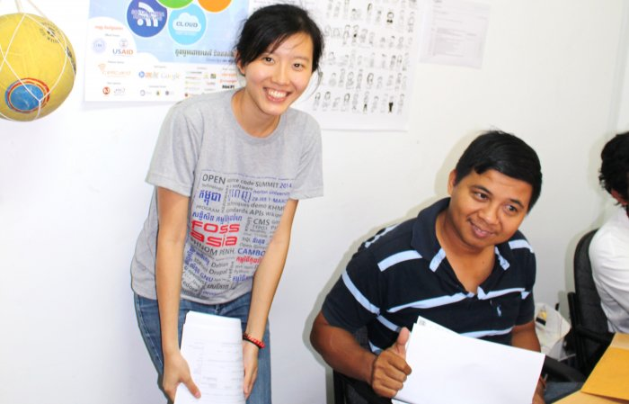

# Schedule

## 3 Days of Pure Knowledge Sharing, 71 International Speakers, 15 Presenters from Cambodia, 121 Talks, Workshops and Panels, 8 tracks per day, Hands-on Labs and Hacking practice for everyone.

## Please click above to download the detailed schedule as pdf.

# Agenda

The main topics of FOSSASIA 2014 are all related to Free and Open Source Software with talks and workshops about Mobile Solutions, Web Technologies, Linux Operating Systems, Open Education and Open Map solutions.

| Day                        | Time          | Event               |Location                 |
|:---------------------------|:-------------:|:-------------------:|------------------------:|
|    **Thursday, Feb.27**    | 19.00         | Pre-Meeting         |     Angkor International Hotel, Social Meet up    |
|    **Friday, Feb.28**      | 9.00-12.00      |   Opening Talks and Keynotes  |   Norton University Main Hall     |
|                            | 12.00-17.00   | Talks and Workshop Sessions |    Norton University Class Rooms and Main Hall |
|    **Saturday, Mar.1**     | 9.00-17.00      |    Community Day (talks, workshops)  |      Norton University Class Rooms and Main Hall     |
|                            | Evening | Social Event | Location in the city to be announced |
|    **Sunday, Mar. 2**      | 9.00-15.30  |  Phnom Penh Hands-on Day  | Open Institute |

## Location: Street 352, Open Institute, Phnom Penh, Cambodia [Map](http://goo.gl/maps/2zDkb)

	 
	 
	

