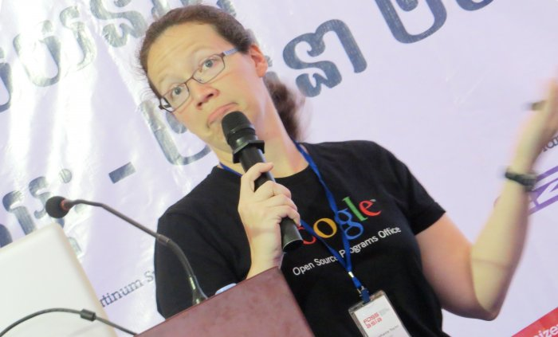
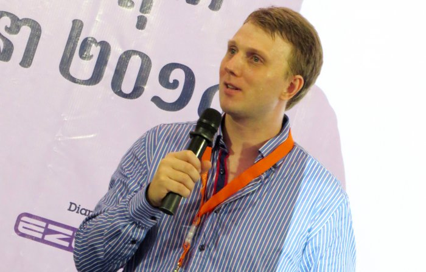

#Schedule Saturday March 1

####Day 2, Track 1-4

<table class="tg" style="undefined;table-layout: fixed; width: 835px">
<colgroup>
<col style="width: 92.19999998807907px">
<col style="width: 211.19999998807907px">
<col style="width: 176.19999998807907px">
<col style="width: 175.19999998807907px">
<col style="width: 180.19999998807907px">
</colgroup>
  <tr>
    <th class="tg-ipa1">Time</th>
    <th class="tg-ipa1">Main Hall</th>
    <th class="tg-ipa1">Mobile and Web</th>
    <th class="tg-ipa1">Web CMS and Frameworks</th>
    <th class="tg-ipa1">Wikipedia and Open Education</th>
  </tr>
  <tr>
    <td class="tg-s6z2">09:00</td>
    <td class="tg-031e">How to Become a [ Media ] Wiki Hacker, Harsh Kothari, 25 min</td>
    <td class="tg-031e">COMPED-First Step towards a Web Literate World, Gauthamraj Elango, 25 min.</td>
    <td class="tg-031e">Contributing to GNU Mailman with a little help from Django, Sneha Priscilla Makini, 25 min.</td>
    <td class="tg-031e">Adoption of OpenOffice in Cambodian Education System, Piseth Kheng, 55 min.</td>
  </tr>
  <tr>
    <td class="tg-s6z2">09:30</td>
    <td class="tg-031e">OpenStreetMap for Disaster Preparedness and Response, Kate Chapman, 25 min.</td>
    <td class="tg-031e">Open Source Apps on Blackberry devices, Justin Lee, 25 min.</td>
    <td class="tg-031e">Building Websites with Drupal, Tomo Huynh, 25 min.</td>
    <td class="tg-031e"></td>
  </tr>
  <tr>
    <td class="tg-s6z2">10:00</td>
    <td class="tg-031e">Google Code-in, Stephanie Taylor, 25 min</td>
    <td class="tg-031e">The Good, The Bad and The Ugly: Walking through a simple</td>
    <td class="tg-031e">Drupal in local languages to power SMEs, non-profits of</td>
    <td class="tg-031e">Deploying free educational projects, Pockey Lam, 55 min.</td>
  </tr>
  <tr>
    <td class="tg-s6z2">10:30</td>
    <td class="tg-031e">Google Summer of Code - Student Lightning Talks and Q&amp;A; Cat Allman, Stephanie Taylor, GSoC students, Moderation:</td>
    <td class="tg-031e">Android Application Development, Mohit Kanwal, 1h Workshop</td>
    <td class="tg-031e">emerging countries &amp; Building local language communities, Hari Prasad Nadig, 55 min.</td>
    <td class="tg-031e"></td>
  </tr>
  <tr>
    <td class="tg-s6z2">11:00</td>
    <td class="tg-031e">Hong Phuc Dang, Mario Behling, 1.5 h</td>
    <td class="tg-031e">Easy and Maintainable Web API for your next Mobile App, Arul</td>
    <td class="tg-031e">Hands-on: WordPress plugin development for brand awareness and</td>
    <td class="tg-031e">FOSS Localization and adoption of FOSS in the education system</td>
  </tr>
  <tr>
    <td class="tg-s6z2">11:30</td>
    <td class="tg-031e">Build your web app over the weekend, using Django and continuous deployment to Heroku, Hong Le Viet, 25 min.</td>
    <td class="tg-031e">Kumaran Ragunathan, 55 min.</td>
    <td class="tg-031e">profit, Michael Cannon, 1.5h Workshop</td>
    <td class="tg-031e">Sokhem, Khoem, 55 min.</td>
  </tr>
  <tr>
    <td class="tg-s6z2">12:00</td>
    <td class="tg-031e">Embracing the Static Web, Lakshan Perera, 25 min.</td>
    <td class="tg-031e">Open Source technologies that revitalize your phones, Sokha Rum, 1h</td>
    <td class="tg-031e"></td>
    <td class="tg-031e">A Pragmatic Stack: K-12 education using FOSS, Lyle Kozloff, 25 min.</td>
  </tr>
  <tr>
    <td class="tg-s6z2">12:30</td>
    <td class="tg-031e">Asian Mobile Culture and Who Will Control the Data of the Next Billion Internet Users, Arthit Suriyawongkul. 25 min.</td>
    <td class="tg-031e"></td>
    <td class="tg-031e">Octopress, Sophearak Tha, 1h Workshop</td>
    <td class="tg-031e">Khmer Wikipedia and the free knowledge movement in Cambodia, Vantharith Oum, Workshop 1h (Khmer)</td>
  </tr>
  <tr>
    <td class="tg-s6z2">13:00</td>
    <td class="tg-031e">SlateKit.org, open source tablet UX building kit, Ping-Hsun Chen, 25 min.</td>
    <td class="tg-s6z2">Webmaker - helping you create something amazing on the web, Ankit Gadgil, 1h Workshop</td>
    <td class="tg-031e"></td>
    <td class="tg-031e"></td>
  </tr>
  <tr>
    <td class="tg-s6z2">13:30</td>
    <td class="tg-s6z2">From Open Source to Open Government – g0v.tw, Chia-liang Kao, 55 min.</td>
    <td class="tg-s6z2"></td>
    <td class="tg-s6z2"></td>
    <td class="tg-s6z2">Documentation - not just prose!, Sundar Sindhu, 55 min.</td>
  </tr>
  <tr>
    <td class="tg-s6z2">14:00</td>
    <td class="tg-s6z2"></td>
    <td class="tg-s6z2">Interaction Design with Google Web Designer, Fernando Travieso, 1h Workshop</td>
    <td class="tg-s6z2">Exploring TiddlySpace for use in workgroup environment, Handoko Suwono, 55 min.</td>
    <td class="tg-s6z2"></td>
  </tr>
  <tr>
    <td class="tg-s6z2">14:30</td>
    <td class="tg-s6z2">Qt/C++ on Mobile/Android, Sebastian Sauer, 25 min.</td>
    <td class="tg-s6z2"></td>
    <td class="tg-s6z2"></td>
    <td class="tg-s6z2">Pronunciation Recording Tool for Wikimedia Foundation, Rahul James Maliakkal, 25 min.</td>
  </tr>
  <tr>
    <td class="tg-s6z2">15:00</td>
    <td class="tg-s6z2">Open source implementation of Chinese virtual singer, Ying-Chun Liu (Paul Liu), 25 min.</td>
    <td class="tg-s6z2">Qt5 and QtQuick2 introduction: A step by step Ubuntu Touch SDK, Ping-Hsun Chen, 1h Workshop</td>
    <td class="tg-s6z2">SEO Success Factors for Search Engine Friendly Websites, Sophy Prak, 55 min.</td>
    <td class="tg-s6z2">Mediawiki Extension: Annotator, Richa Jain, 25 min.</td>
  </tr>
  <tr>
    <td class="tg-s6z2">15:30</td>
    <td class="tg-s6z2">Making cool presentations with Inkscape and Sozi, Frederic Muller, 25 min.</td>
    <td class="tg-s6z2"></td>
    <td class="tg-s6z2"></td>
    <td class="tg-s6z2">MediaWiki Gadget Kitchen Workshop, Harsh Kothari, 1h Workshop</td>
  </tr>
  <tr>
    <td class="tg-s6z2">16:00</td>
    <td class="tg-s6z2">Piwik - Free Web Analytics Framework, Kien Truc Le, 25 min.</td>
    <td class="tg-s6z2"></td>
    <td class="tg-s6z2"></td>
    <td class="tg-s6z2"></td>
  </tr>
  <tr>
    <td class="tg-s6z2">16:30</td>
    <td class="tg-s6z2">Open Source in Education, Preetam Rai, 20 min.</td>
    <td class="tg-s6z2"></td>
    <td class="tg-s6z2"></td>
    <td class="tg-s6z2"></td>
  </tr>
  <tr>
    <td class="tg-s6z2">16:50</td>
    <td class="tg-031e">Wrap up and info of Sunday workshops, Hong Phuc Dang, Mario Behling; End of Sessions</td>
    <td class="tg-031e"></td>
    <td class="tg-031e"></td>
    <td class="tg-031e"></td>
  </tr>
</table>

####Day 2, Track 5-8

<table class="tg" style="undefined;table-layout: fixed; width: 835px">
<colgroup>
<col style="width: 92.19999998807907px">
<col style="width: 211.19999998807907px">
<col style="width: 176.19999998807907px">
<col style="width: 175.19999998807907px">
<col style="width: 180.19999998807907px">
</colgroup>
  <tr>
    <th class="tg-ipa1">Time</th>
    <th class="tg-ipa1">Development, Deployment, Security</th>
    <th class="tg-ipa1">Localization, Fonts, Graphics</th>
    <th class="tg-ipa1">Open Everything</th>
    <th class="tg-ipa1">Fedora</th>
  </tr>
  <tr>
    <td class="tg-s6z2">09:00</td>
    <td class="tg-031e">Improving IPv6 Attack Detector, Jianjun Chen, 25 min.</td>
    <td class="tg-031e">Hands-on: How to Create Vector Graphics Art and Icons with Inkscape, Sirko Kemter, 2h Workshop</td>
    <td class="tg-031e">Linux Cambodia, Jose de Soto, 55 min.</td>
    <td class="tg-031e"></td>
  </tr>
  <tr>
    <td class="tg-s6z2">09:30</td>
    <td class="tg-031e">Build your own local Mesh Network with standard Wi-Fi Routers, Bastian Bittorf,, 2h Workshop</td>
    <td class="tg-031e"></td>
    <td class="tg-031e"></td>
    <td class="tg-031e"></td>
  </tr>
  <tr>
    <td class="tg-s6z2">10:00</td>
    <td class="tg-031e"></td>
    <td class="tg-031e"></td>
    <td class="tg-031e">OpenMRS, Harsha Siriwardena, 25 min.</td>
    <td class="tg-031e"></td>
  </tr>
  <tr>
    <td class="tg-s6z2">10:30</td>
    <td class="tg-031e"></td>
    <td class="tg-031e"></td>
    <td class="tg-031e">Mapping areas with OpenStreetMap, Kate Chapman, 1h Workshop</td>
    <td class="tg-031e">Building a Fedora Clustering/Load Balancing System using Linux Virtual Server, Nguyen Nang Thang, Workshop (1 hour)</td>
  </tr>
  <tr>
    <td class="tg-s6z2">11:00</td>
    <td class="tg-031e"></td>
    <td class="tg-031e">Openclipart for Developers, Jon</td>
    <td class="tg-031e"></td>
    <td class="tg-031e"></td>
  </tr>
  <tr>
    <td class="tg-s6z2">11:30</td>
    <td class="tg-031e">Reproducible and portable work environments with Vagrant and Chef, Michael Knoll, 55 min.</td>
    <td class="tg-031e">Phillips, 55 min.</td>
    <td class="tg-031e">How Free/Open Source Software could help your project/Startup, Wan Leung Wong, 25 min.</td>
    <td class="tg-031e">Document your code, Kushal Das, 25 min.</td>
  </tr>
  <tr>
    <td class="tg-s6z2">12:00</td>
    <td class="tg-031e"></td>
    <td class="tg-031e"></td>
    <td class="tg-031e">ExpEYES : An Open Source Portable Science Lab, Praveen Patil, 1h Workshop</td>
    <td class="tg-031e">Fedora Ambassadors Program: by Truong Anh Tuan, 25 min.</td>
  </tr>
  <tr>
    <td class="tg-s6z2">12:30</td>
    <td class="tg-031e">Open Source based (Enterprise) Architecture and Design, Vu Hung Nguyen, 55 min.</td>
    <td class="tg-031e"></td>
    <td class="tg-031e"></td>
    <td class="tg-031e"></td>
  </tr>
  <tr>
    <td class="tg-s6z2">13:00</td>
    <td class="tg-031e"></td>
    <td class="tg-s6z2">Khmer Keyboard for Smart Devices, Hong Danh, 55 min.</td>
    <td class="tg-031e"></td>
    <td class="tg-031e"></td>
  </tr>
  <tr>
    <td class="tg-s6z2">13:30</td>
    <td class="tg-s6z2">Secret Lives of Patches, Ray Chuan Tay, 25 min</td>
    <td class="tg-s6z2"></td>
    <td class="tg-s6z2">QGIS: Spatial database, geoprocessing, visualization, Seila Nhiep, 25 min.</td>
    <td class="tg-s6z2">Logical Volume Managment(LVM) with Fedora, Uditha Bandara Wijerathna, 1h Workshop</td>
  </tr>
  <tr>
    <td class="tg-s6z2">14:00</td>
    <td class="tg-s6z2">New Storage Features in QEMU/KVM, Fam Zheng, 55 min.</td>
    <td class="tg-s6z2">Journey of Bsdconv: Unicode, Charset, Encoding, Conversion, Detection, Variants, Kuan-Chung Chiu, 55 min.</td>
    <td class="tg-s6z2">Webconverger and Going into business fulltime with Open Source, Kai Hendry, 25 min.</td>
    <td class="tg-s6z2"></td>
  </tr>
  <tr>
    <td class="tg-s6z2">14:30</td>
    <td class="tg-s6z2"></td>
    <td class="tg-s6z2"></td>
    <td class="tg-s6z2">Why you should choose Ruby on Rails for your next web project, Channa Ly, 55 min.</td>
    <td class="tg-s6z2">GlitterGallery for Fedora design work, Sarup Banskota, 25 min.</td>
  </tr>
  <tr>
    <td class="tg-s6z2">15:00</td>
    <td class="tg-s6z2">Secure your communications: Tor, Email Encryption, GnuPGP; Roberto Soriano, 1.5h Workshop</td>
    <td class="tg-s6z2">Optimizations of the Terrain System in a 3D Scene, Xiangquan Xiao, 25 min.</td>
    <td class="tg-s6z2"></td>
    <td class="tg-s6z2">Fedora Design Suite, Gnokii, 25 min.</td>
  </tr>
  <tr>
    <td class="tg-s6z2">15:30</td>
    <td class="tg-s6z2"></td>
    <td class="tg-s6z2">Open Comics as an educative and interactive tool, John Weeks, 25 mins.</td>
    <td class="tg-s6z2"></td>
    <td class="tg-s6z2">Building a Fedora Clustering/High-Availability System using Pacemaker &amp; Corosync:</td>
  </tr>
  <tr>
    <td class="tg-s6z2">16:00</td>
    <td class="tg-s6z2"></td>
    <td class="tg-s6z2"></td>
    <td class="tg-s6z2"></td>
    <td class="tg-s6z2">by Nguyen Nang Thang, 1h Workshop</td>
  </tr>
  <tr>
    <td class="tg-s6z2">16:30</td>
    <td class="tg-s6z2"></td>
    <td class="tg-s6z2"></td>
    <td class="tg-s6z2"></td>
    <td class="tg-s6z2"></td>
  </tr>
  <tr>
    <td class="tg-s6z2">16:50</td>
    <td class="tg-031e">Wrap up and info of Sunday </td>
    <td class="tg-031e">workshops, Hong Phuc </td>
    <td class="tg-031e">Dang, Mario Behling; </td>
    <td class="tg-031e">End of Sessions</td>
  </tr>
</table>

