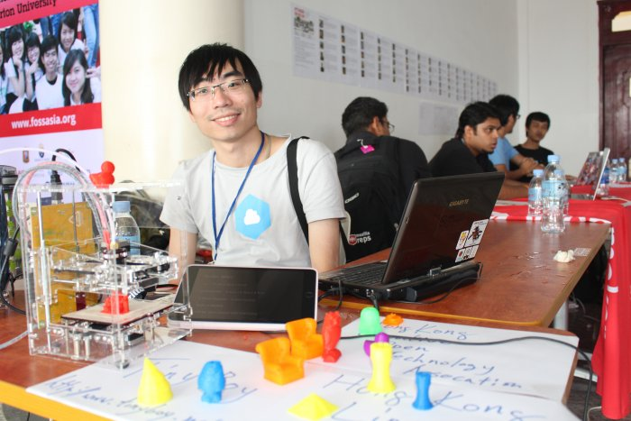

#Schedule Friday February 28

####Day - Track 1-4

<table class="tg" style="undefined;table-layout: fixed; width: 828px auto;">
<colgroup>
<col style="width: 86.19999998807907px">
<col style="width: 204.19999998807907px">
<col style="width: 182.19999998807907px">
<col style="width: 178.19999998807907px">
<col style="width: 177.19999998807907px">
</colgroup>
  <tr>
    <th class="tg-ipa1">Time</th>
    <th class="tg-ipa1">Main Hall</th>
    <th class="tg-ipa1">Mobile and Web</th>
    <th class="tg-ipa1">Web CMS and Frameworks</th>
    <th class="tg-ipa1">Community</th>
  </tr>
  <tr>
    <td class="tg-s6z2">13:00</td>
    <td class="tg-031e">How to build your own local Internet with standard Wi-Fi Routers", Bastian Bittorf, 25 min.</td>
    <td class="tg-031e">PhoneGap, Danet Krueng, 55 min.</td>
    <td class="tg-031e">TYPO3 Enterprise Features, Sengchheang Chhun, 55 min. (Khmer)</td>
    <td class="tg-031e">KDE and the FOSS community in India: A Revolution in Itself, Yash Shah, 25 min.</td>
  </tr>
  <tr>
    <td class="tg-s6z2">13:30</td>
    <td class="tg-031e">Panel: Network and Internet Development in Cambodia, Glenn Miller (CIO Ezecom, Bastian Bittorf (CEO Bittorf Wireless), Kheng Vantha (Co-founder Biz Solution), Mario Behling (CEO MBM</td>
    <td class="tg-031e"></td>
    <td class="tg-031e"></td>
    <td class="tg-031e">Open Source in Hong Kong, Wan Leung Wong, 25 min.</td>
  </tr>
  <tr>
    <td class="tg-s6z2">14:00</td>
    <td class="tg-031e">International)</td>
    <td class="tg-031e">Easy Android app creation for everyone, Preetam Rai, 1h Workshop</td>
    <td class="tg-031e">SEO Success Factors for Search Engine Friendly Websites, Sophy Prak, 55 min.</td>
    <td class="tg-031e">Contributing to GNOME, Sindhu Sundar, 1h Workshop</td>
  </tr>
  <tr>
    <td class="tg-s6z2">14:30</td>
    <td class="tg-031e">Tinyboy Project - A 3D printer for student, Wan Leung Wong, 25 min.</td>
    <td class="tg-031e"></td>
    <td class="tg-031e"></td>
    <td class="tg-031e"></td>
  </tr>
  <tr>
    <td class="tg-s6z2">15:00</td>
    <td class="tg-031e">WordPress plugin development for brand awareness and profit, Michael Cannon, 25 min.</td>
    <td class="tg-031e">How to create Firefox OS apps, Biraj Karmakar, 55 min.</td>
    <td class="tg-031e">Getting started with Rails, Yash Shah, Intensive Workshop, 25 min</td>
    <td class="tg-031e">How to contribute to Open Source, Phallin Hor, 25 min. (Khmer)</td>
  </tr>
  <tr>
    <td class="tg-s6z2">15:30</td>
    <td class="tg-031e">Build your web app over the weekend, using Django and continuous deployment to Heroku, Hong Le Viet, 25 min.</td>
    <td class="tg-031e"></td>
    <td class="tg-031e">TYPO3 FLOW - Web Socket, Chanthou Nim, 55 min. (Khmer)</td>
    <td class="tg-031e">How to contribute to Debian, Prach Pongpanich, 25 min.</td>
  </tr>
  <tr>
    <td class="tg-s6z2">16:00</td>
    <td class="tg-031e">Panel: Women in IT, Hong Phuc Dang (FOSSASIA), Cat Allman (Google), Sindhu Sundar (GNOME), Pockey Lam (Digital Freedom Foundation),</td>
    <td class="tg-031e">Developing Web-apps for FirefoxOS, Sayak Sarkar Workshop 1h</td>
    <td class="tg-031e"></td>
    <td class="tg-031e">How to ask for help in Open Source projects, Xiangquan Xiao, 25 min.</td>
  </tr>
  <tr>
    <td class="tg-s6z2">16:30</td>
    <td class="tg-031e">Sneha Priscilla Makini (GNU Mailman), Richa Jain (Mediawiki), 1h Panel</td>
    <td class="tg-031e"></td>
    <td class="tg-031e"></td>
    <td class="tg-031e"></td>
  </tr>
  <tr>
    <td class="tg-s6z2">17:00</td>
    <td class="tg-031e"></td>
    <td class="tg-s6z2">End of Sessions</td>
    <td class="tg-031e"></td>
    <td class="tg-031e"></td>
  </tr>
</table>

